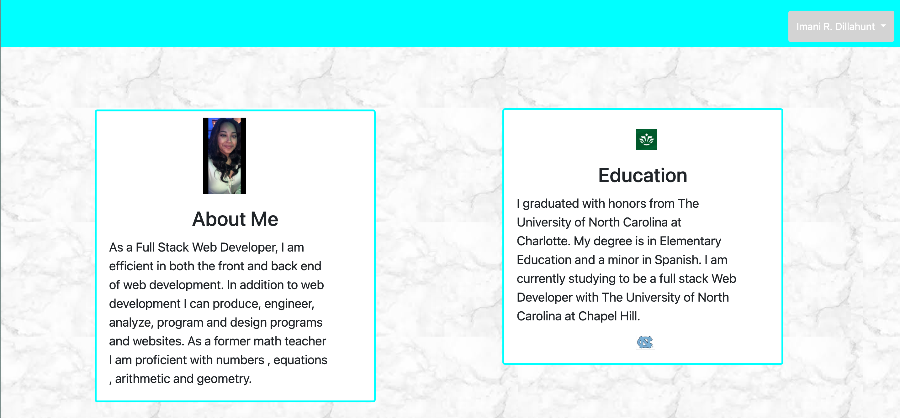
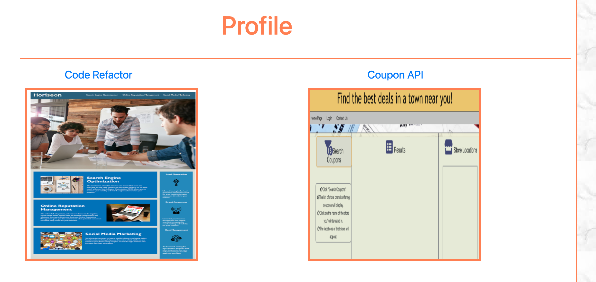
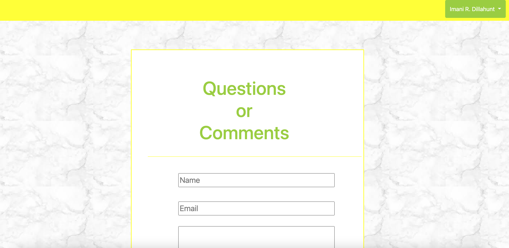

<h1>Porfolio</h1>

**Description**

This portfolio was designed to be mobile responsive. It includes bootstrap (navbar, grid system, containers,rows and columns), personalized information, portfolio snippets and a contact form. 

**Installation**

Use the following html link to access the website.
```https://imanid-code.github.io/Portfolio``` 

**Usage**
A web application that gives background knowledge of you as a person. It also displays some examples of your applications you've created.  




**Technology**


 ```Bootstrap```   ```HTML```   ```CSS```