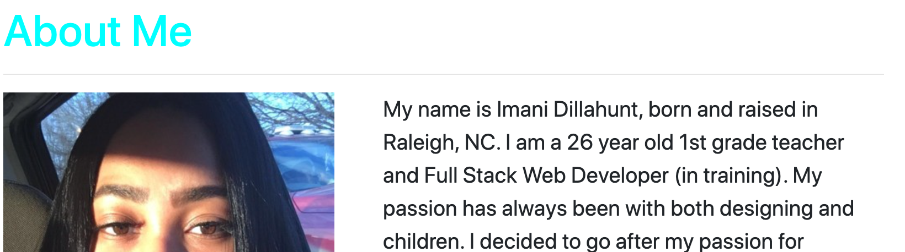
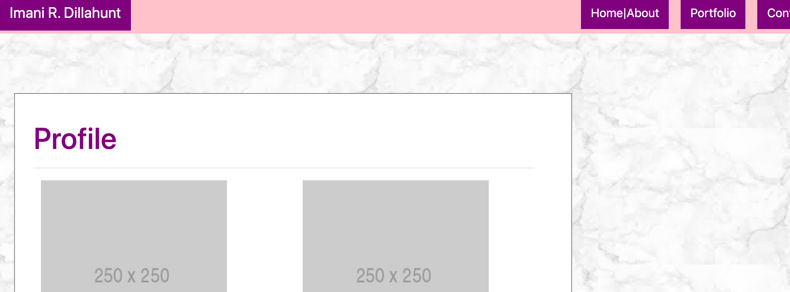
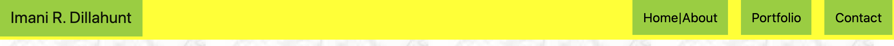
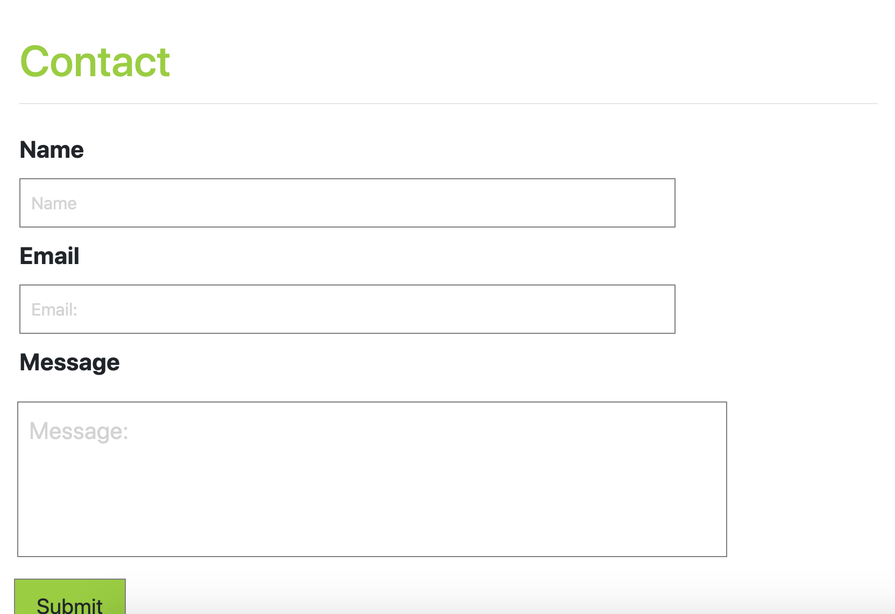

<h1>Porfolio</h1>

**Description**

This portfolio was designed to be mobile responsive. It includes bootstrap (navbar, grid system, containers,rows and columns), personalized information, portfolio snippets and a contact form. 

**Installation**

Use the following html link to access the website.
```bash enterwebsitehere``` 

**Usage**
Using the navigation bar at the top you can maneuver through the portfolio to find: a biographical paragraph, snippets of web designs and how to contact the developer. 


If you click on the ```Home|About ``` button in the navigation bar it will take you here for a short biographical paragraph and image of the developer. 


 <hr>
 Each time you navigate to a different page the color scheme will change. Once you click on ``` Portfolio ``` you will see placeholders for upcoming developments. 
 
<hr>
 The color scheme will change again once you click on the ``` Contact ``` button in the navigation bar.
  
 The contact page is for people who visit the website/app to be able to reach the developer. They can leave their Name, Email and A message.


**Contribution**
